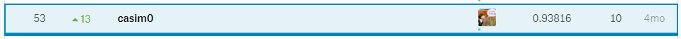

# 2019 3rd ML month with KaKR
자동차 이미지 데이터셋을 이용한 차종 분류

https://www.kaggle.com/c/2019-3rd-ml-month-with-kakr/overview

처음으로 신경망 모델을 쓰게 된 대회였으며, 이미지 관련하여 공부를 할 수 있었던 계기가 됬습니다.

이전에도 딥러닝 관련하여 공부를 조금씩 했지만, 독학하는 데 너무 어려워 지루했었습니다. 

실전에 부딪혀 구글링을 통하여 습득하는 것이 더 즐거운 공부를 할 수 있을 것이라 판단하던 도중에 마침 Kaggle Korea에서 이미지 분류 대회가 열렸습니다.

총 156팀 중 53등을 하였습니다.

상위 50등팀은 Google Developers 우산을 받을 수 있었는데, 3등차이로 못받게 되었습니다. 조금 아쉽지만.. 저에겐 이전 2nd 대회 상품으로 받은 Google Developers 후드집업이 있습니다. ㅎㅎ

## 대회 요약

### 1. Overview
많은 차종을 구별하는 것은 사람일지라도 쉽지가 않은데요. 만약, 그림만 보고 자동차의 모델(Class)을 쉽게 예측할 수 있다면 CCTV나 블랙박스 속의 차량을 자동으로 분류, 감지해서 범죄예방에 도움을 줄 수 있는 등 다양한 곳에 유익하게 사용될 수 있습니다.

### 2. Timeline
* 2019년 6월 14일 (금) 12:00 (GMT+9, 한국시간) - 컴페티션 시작
* 2019년 8월 17일 (토) 00:00 (GMT+9, 한국시간) - 컴페티션 종료

### 3. Prize

1. 리더보드 상위 50팀 !
  - 대회 종료 직후 private 점수 순으로 리더보드 상위 50팀 ! (팀 전체 증정)
  - 커널 제출자에 한함 (public 공개 필수)
  - 상품 : Google Developers 우산 !

2. 커널 상위 20인 !
  - 커널 순위 상위 20인 !
  - 상위 커널 기준은 upvote순으로 결정 !
  - 상품 : Google Developers 칫솔 살균기 !
